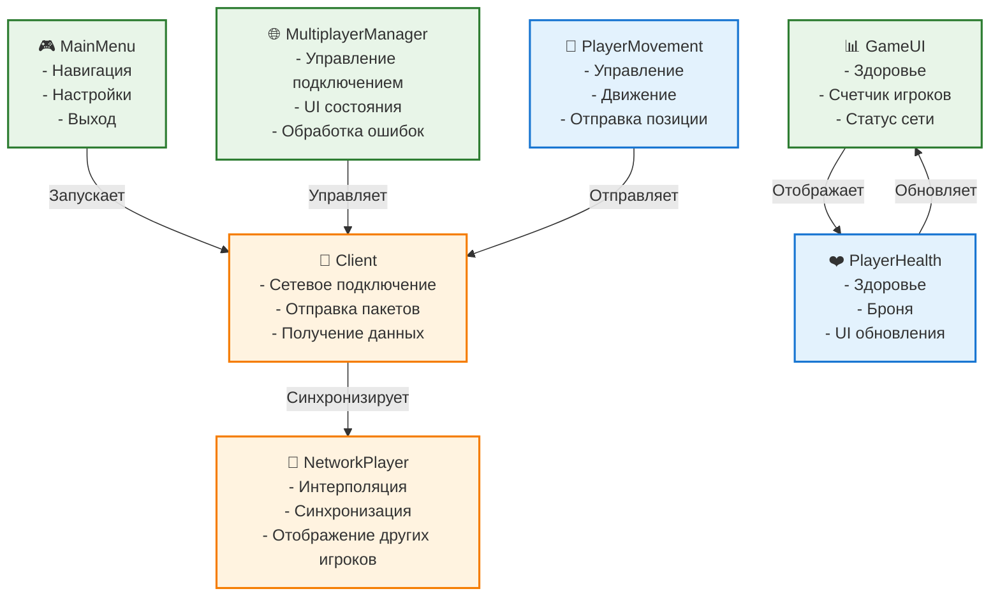

# Компоненты Unity Client

## Обзор

Unity Client состоит из нескольких ключевых компонентов, каждый из которых отвечает за определенную функциональность игровой системы.

## Архитектура компонентов



## Основные компоненты

### UI Components

#### MainMenu.cs
**Назначение**: Главное меню игры
**Ответственность**:
- Навигация между сценами
- Настройки подключения
- Выход из игры

**Ключевые методы**:
```csharp
private void StartSingleplayer()
private void StartMultiplayer()
private void OpenSettings()
private void ExitGame()
```

**UI элементы**:
- Кнопка одиночной игры
- Кнопка мультиплеера
- Кнопка настроек
- Кнопка выхода

#### GameUI.cs
**Назначение**: Игровой пользовательский интерфейс
**Ответственность**:
- Отображение здоровья игрока
- Показ количества игроков
- Статус сетевого подключения
- Настройки во время игры

**UI элементы**:
- Полоска здоровья
- Полоска брони
- Счетчик игроков
- Индикатор подключения

#### MultiplayerManager.cs
**Назначение**: Управление мультиплеером
**Ответственность**:
- Переключение между UI панелями
- Обработка состояния подключения
- Управление ошибками сети

**Состояния**:
- Подключение к серверу
- Игра
- Ошибка подключения
- Отключение

### Game Components

#### Client.cs
**Назначение**: Основной сетевой клиент
**Ответственность**:
- Подключение к серверу
- Отправка и получение пакетов
- Управление сетевым состоянием

**Ключевые методы**:
```csharp
public void ConnectToServer()
public void SendPacket(IPacket packet)
private void OnNetworkReceive(NetPeer peer, NetPacketReader reader)
private void OnConnected(NetPeer peer)
private void OnDisconnected(NetPeer peer)
```

**Сетевые события**:
- PeerConnectedEvent
- PeerDisconnectedEvent
- NetworkReceiveEvent
- NetworkErrorEvent

#### NetworkPlayer.cs
**Назначение**: Сетевая синхронизация других игроков
**Ответственность**:
- Интерполяция движения
- Отображение состояния игроков
- Обработка сетевых обновлений

**Ключевые особенности**:
```csharp
public void Initialize(PlayerState playerState)
public void UpdateState(PlayerState newState)
private void InterpolateMovement()
private void DisableLocalPlayerComponents()
```

**Интерполяция**:
- Плавное движение между позициями
- Ограничение максимального расстояния
- Настраиваемая скорость интерполяции

### Player Components

#### PlayerMovement.cs
**Назначение**: Управление локальным персонажем
**Ответственность**:
- Обработка пользовательского ввода
- Движение персонажа
- Отправка позиции на сервер

**Управление**:
```csharp
// Движение
float horizontal = Input.GetAxis("Horizontal");
float vertical = Input.GetAxis("Vertical");

// Поворот камеры
float mouseX = Input.GetAxis("Mouse X");
float mouseY = Input.GetAxis("Mouse Y");

// Прыжок
if (Input.GetKeyDown(KeyCode.Space))
{
    Jump();
}

// Стрельба
if (Input.GetMouseButtonDown(0))
{
    Shoot();
}
```

**Физика**:
- CharacterController для движения
- Гравитация
- Коллизии с окружением
- Ограничения скорости

#### PlayerHealth.cs
**Назначение**: Система здоровья и брони
**Ответственность**:
- Отслеживание здоровья
- Обработка урона
- UI обновления
- Подбор предметов

**Система урона**:
```csharp
public void TakeDamage(float damage)
{
    float damageToHealth = damage;
    
    if (currentArmor > 0)
    {
        float damageToArmor = damage * armorDamageReduction;
        damageToHealth = damage * (1 - armorDamageReduction);
        currentArmor -= damageToArmor;
    }
    
    currentHealth -= damageToHealth;
    UpdateHealthUI();
}
```

**Подбор предметов**:
- Аптечки (восстановление здоровья)
- Броня (защита от урона)
- Автоматическое применение

## Сетевое взаимодействие

### Отправка пакетов
```csharp
// Движение игрока
var movePacket = new PlayerMovePacket
{
    Position = new Vector3Serializable(transform.position),
    Rotation = new Vector3Serializable(transform.rotation.eulerAngles),
    ClientTick = GetCurrentTick()
};
SendPacket(movePacket);

// Стрельба
var shootPacket = new PlayerShootPacket
{
    Direction = new Vector3Serializable(transform.forward),
    ClientTick = GetCurrentTick()
};
SendPacket(shootPacket);
```

### Получение пакетов
```csharp
private void HandleWorldState(WorldStatePacket worldState)
{
    foreach (var playerState in worldState.PlayerStates)
    {
        if (playerState.Id == localPlayerId)
        {
            // Обновление локального игрока
            UpdateLocalPlayer(playerState);
        }
        else
        {
            // Обновление других игроков
            UpdateNetworkPlayer(playerState);
        }
    }
}
```

## Оптимизация

### Сетевая оптимизация
- **Частота отправки**: 20 пакетов в секунду
- **Интерполяция**: Плавное движение других игроков
- **Предсказание**: Локальное предсказание движения
- **Сжатие**: MessagePack для компактности

### Графическая оптимизация
- **LOD**: Level of Detail для объектов
- **Occlusion Culling**: Отсечение невидимых объектов
- **Object Pooling**: Переиспользование объектов
- **GPU Instancing**: Массовый рендеринг

### Оптимизация памяти
- **Garbage Collection**: Минимизация аллокаций
- **Object Pooling**: Переиспользование сетевых пакетов
- **Asset Management**: Правильная загрузка ресурсов

## Конфигурация

### Настройки сети
```csharp
[Header("Network Settings")]
public int serverPort = 8050;
public string serverAddress = "77.233.222.200";
public float sendRate = 20f;
```

### Настройки интерполяции
```csharp
[Header("Interpolation Settings")]
public float interpolationSpeed = 10f;
public float maxDistance = 1f;
```

### Настройки производительности
- **Target FPS**: 60
- **VSync**: Отключен для минимальной задержки
- **Quality Settings**: Настраиваемые уровни качества
- **Resolution**: Адаптивное разрешение

## Обработка ошибок

### Сетевые ошибки
```csharp
private void OnNetworkError(IPEndPoint endPoint, SocketError socketError)
{
    Debug.LogError($"Network error: {socketError}");
    // Попытка переподключения
    StartCoroutine(ReconnectAfterDelay());
}
```

### Ошибки подключения
- **Таймаут**: Автоматическое переподключение
- **Неверный адрес**: Уведомление пользователя
- **Сервер недоступен**: Ожидание и повторная попытка

### Ошибки игры
- **Потеря соединения**: Сохранение состояния
- **Некорректные данные**: Валидация пакетов
- **Производительность**: Адаптация качества

## Тестирование

### Unit тесты
- Тестирование сетевой логики
- Валидация пакетов
- Тестирование интерполяции

### Интеграционные тесты
- Подключение к серверу
- Синхронизация состояния
- Обработка ошибок

### Производительность
- Профилирование FPS
- Анализ сетевого трафика
- Тестирование под нагрузкой

## Планы развития

### Краткосрочные улучшения
- [ ] Улучшение UI/UX
- [ ] Оптимизация сетевого кода
- [ ] Добавление звуковых эффектов
- [ ] Система настроек

### Среднесрочные улучшения
- [ ] Мобильная версия
- [ ] Система достижений
- [ ] Кастомизация персонажа
- [ ] Чат между игроками

### Долгосрочные улучшения
- [ ] VR поддержка
- [ ] Кроссплатформенная игра
- [ ] Моддинг система
- [ ] Облачное сохранение 