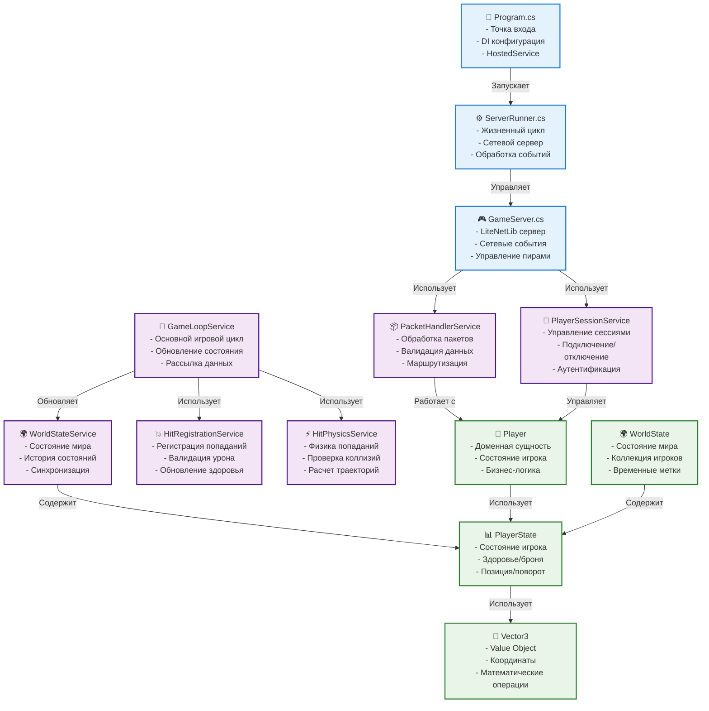

# Компоненты Game Server

## Обзор

Game Server построен на принципах Clean Architecture и Domain-Driven Design, разделяя ответственность между различными слоями и компонентами.

## Архитектура компонентов



## Backend Layer

### Program.cs
**Назначение**: Точка входа приложения
**Ответственность**:
- Конфигурация Dependency Injection
- Настройка логирования
- Запуск HostedService

**Ключевые методы**:
```csharp
public static async Task Main(string[] args)
{
    var host = CreateHostBuilder(args).Build();
    await host.RunAsync();
}

private static IHostBuilder CreateHostBuilder(string[] args) =>
    Host.CreateDefaultBuilder(args)
        .ConfigureServices((hostContext, services) =>
        {
            services.AddHostedService<ServerRunner>();
            services.AddSingleton<GameServer>();
            services.AddSingleton<GameLoopService>();
            services.AddSingleton<PacketHandlerService>();
            services.AddSingleton<PlayerSessionService>();
            services.AddSingleton<WorldStateService>();
            services.AddSingleton<HitRegistrationService>();
            services.AddSingleton<HitPhysicsService>();
        })
        .ConfigureLogging(logging =>
        {
            logging.ClearProviders();
            logging.AddSimpleConsole(options =>
            {
                options.SingleLine = true;
                options.TimestampFormat = "HH:mm:ss ";
            });
        });
```

### ServerRunner.cs
**Назначение**: HostedService для управления жизненным циклом сервера
**Ответственность**:
- Запуск и остановка сервера
- Управление сетевыми событиями
- Координация сервисов

**Ключевые методы**:
```csharp
public async Task StartAsync(CancellationToken cancellationToken)
{
    _gameServer.Start();
    _gameLoopService.Start();
    _logger.LogInformation("DeathRoom server started on port 9050");
}

public async Task StopAsync(CancellationToken cancellationToken)
{
    _gameServer.Stop();
    _gameLoopService.Stop();
    _logger.LogInformation("DeathRoom server stopped");
}
```

### GameServer.cs
**Назначение**: Сетевой сервер на базе LiteNetLib
**Ответственность**:
- Управление сетевыми соединениями
- Обработка сетевых событий
- Маршрутизация пакетов

**Сетевые события**:
```csharp
private void OnPeerConnected(NetPeer peer)
{
    _logger.LogInformation($"Peer connected: {peer.EndPoint}");
    _playerSessionService.HandlePlayerConnected(peer);
}

private void OnPeerDisconnected(NetPeer peer, DisconnectInfo disconnectInfo)
{
    _logger.LogInformation($"Peer disconnected: {peer.EndPoint}");
    _playerSessionService.HandlePlayerDisconnected(peer);
}

private void OnNetworkReceive(NetPeer peer, NetPacketReader reader)
{
    var data = reader.GetRemainingBytes();
    _packetHandlerService.HandlePacket(peer, data);
}
```

## Application Layer

### GameLoopService.cs
**Назначение**: Основной игровой цикл сервера
**Ответственность**:
- Регулярное обновление состояния мира
- Рассылка состояния клиентам
- Координация игровых событий

**Игровой цикл**:
```csharp
private async Task GameLoop()
{
    while (!_cancellationTokenSource.Token.IsCancellationRequested)
    {
        var startTime = DateTime.UtcNow;
        
        // Обновление состояния мира
        UpdateWorldState();
        
        // Обработка попаданий
        ProcessHits();
        
        // Рассылка состояния клиентам
        BroadcastWorldState();
        
        // Поддержание частоты обновлений
        var elapsed = DateTime.UtcNow - startTime;
        var delay = TimeSpan.FromMilliseconds(16) - elapsed; // 60 FPS
        if (delay > TimeSpan.Zero)
        {
            await Task.Delay(delay, _cancellationTokenSource.Token);
        }
    }
}
```

### PacketHandlerService.cs
**Назначение**: Обработка сетевых пакетов
**Ответственность**:
- Десериализация пакетов
- Валидация данных
- Маршрутизация к соответствующим обработчикам

**Обработка пакетов**:
```csharp
public void HandlePacket(NetPeer peer, byte[] data)
{
    try
    {
        var packet = MessagePackSerializer.Deserialize<IPacket>(data);
        
        switch (packet)
        {
            case LoginPacket loginPacket:
                HandleLoginPacket(peer, loginPacket);
                break;
            case PlayerMovePacket movePacket:
                HandlePlayerMovePacket(peer, movePacket);
                break;
            case PlayerHitPacket hitPacket:
                HandlePlayerHitPacket(peer, hitPacket);
                break;
            case PickUpHealthPacket healthPacket:
                HandlePickUpHealthPacket(peer, healthPacket);
                break;
            case PickUpArmorPacket armorPacket:
                HandlePickUpArmorPacket(peer, armorPacket);
                break;
            default:
                _logger.LogWarning($"Unknown packet type: {packet.GetType()}");
                break;
        }
    }
    catch (Exception ex)
    {
        _logger.LogError($"Error handling packet: {ex.Message}");
    }
}
```

### PlayerSessionService.cs
**Назначение**: Управление игровыми сессиями
**Ответственность**:
- Создание и удаление сессий игроков
- Аутентификация игроков
- Отслеживание состояния подключения

**Управление сессиями**:
```csharp
public void HandlePlayerConnected(NetPeer peer)
{
    var player = new Player
    {
        Id = GetNextPlayerId(),
        Username = $"Player_{player.Id}",
        Peer = peer
    };
    
    _players[peer.Id] = player;
    _logger.LogInformation($"Player {player.Username} connected (ID: {player.Id})");
}

public void HandlePlayerDisconnected(NetPeer peer)
{
    if (_players.TryGetValue(peer.Id, out var player))
    {
        _players.Remove(peer.Id);
        _logger.LogInformation($"Player {player.Username} disconnected (ID: {player.Id})");
    }
}
```

### WorldStateService.cs
**Назначение**: Управление состоянием мира
**Ответственность**:
- Хранение текущего состояния
- История состояний для интерполяции
- Синхронизация между игроками

**Управление состоянием**:
```csharp
public void UpdateWorldState()
{
    var currentTick = GetCurrentTick();
    var playerStates = _players.Values
        .Select(p => p.GetPlayerState())
        .ToList();
    
    var worldState = new WorldState
    {
        PlayerStates = playerStates,
        ServerTick = currentTick
    };
    
    // Сохранение в историю
    _worldStateHistory.Enqueue(worldState);
    if (_worldStateHistory.Count > MaxHistoryLength)
    {
        _worldStateHistory.Dequeue();
    }
    
    _currentWorldState = worldState;
}
```

### HitRegistrationService.cs
**Назначение**: Регистрация и обработка попаданий
**Ответственность**:
- Валидация попаданий
- Применение урона
- Обновление состояния игроков

**Обработка попаданий**:
```csharp
public void RegisterHit(int attackerId, int targetId, Vector3 direction)
{
    if (!_players.TryGetValue(attackerId, out var attacker) ||
        !_players.TryGetValue(targetId, out var target))
    {
        return;
    }
    
    // Валидация попадания
    if (!_hitPhysicsService.ValidateHit(attacker, target, direction))
    {
        return;
    }
    
    // Применение урона
    var damage = CalculateDamage(attacker, target);
    var isKill = target.TakeDamage(damage, GetCurrentTick());
    
    if (isKill)
    {
        HandlePlayerKill(target);
    }
    
    _logger.LogInformation($"Player {attacker.Username} hit {target.Username} for {damage} damage");
}
```

### HitPhysicsService.cs
**Назначение**: Физика попаданий и коллизий
**Ответственность**:
- Проверка возможности попадания
- Расчет траекторий
- Валидация физических ограничений

**Валидация попаданий**:
```csharp
public bool ValidateHit(Player attacker, Player target, Vector3 direction)
{
    // Проверка дистанции
    var distance = Vector3.Distance(attacker.Position, target.Position);
    if (distance > MaxHitDistance)
    {
        return false;
    }
    
    // Проверка линии видимости
    if (!HasLineOfSight(attacker.Position, target.Position))
    {
        return false;
    }
    
    // Проверка угла попадания
    var angle = Vector3.Angle(direction, (target.Position - attacker.Position).normalized);
    if (angle > MaxHitAngle)
    {
        return false;
    }
    
    return true;
}
```

## Domain Layer

### Player.cs
**Назначение**: Доменная сущность игрока
**Ответственность**:
- Бизнес-логика игрока
- Управление состоянием
- Валидация действий

**Основные методы**:
```csharp
public bool TakeDamage(int damage, long tick)
{
    return PlayerState.TakeDamage(damage, tick);
}

public void Move(Vector3 newPosition, Vector3 newRotation)
{
    // Валидация движения
    if (!IsValidMovement(newPosition))
    {
        return;
    }
    
    PlayerState.Position = newPosition;
    PlayerState.Rotation = newRotation;
}

public PlayerState GetPlayerState()
{
    return PlayerState;
}
```

### PlayerState.cs
**Назначение**: Состояние игрока
**Ответственность**:
- Хранение данных игрока
- Логика урона и восстановления
- Сериализация для сети

**Система урона**:
```csharp
public bool TakeDamage(int damage, long tick)
{
    if (this.ArmorExpirationTick > tick) 
    { 
        this.ArmorPoint = 0; 
    }
    
    if (this.ArmorPoint >= damage) {
        this.ArmorPoint -= damage;
        return false;
    } else if (this.ArmorPoint > 0) {
        damage -= this.ArmorPoint;
        this.ArmorPoint = 0;
    }
    
    this.HealthPoint -= damage;
    if (this.HealthPoint <= 0) { 
        this.HealthPoint = 0;
        return true; 
    }
    return false;
}
```

### WorldState.cs
**Назначение**: Состояние игрового мира
**Ответственность**:
- Коллекция состояний игроков
- Временные метки
- Синхронизация

**Структура**:
```csharp
public class WorldState
{
    public List<PlayerState> PlayerStates { get; set; } = new();
    public long ServerTick { get; set; }
    public DateTime Timestamp { get; set; } = DateTime.UtcNow;
}
```

### Vector3.cs
**Назначение**: Value Object для координат
**Ответственность**:
- Математические операции
- Валидация координат
- Конвертация типов

**Основные операции**:
```csharp
public static Vector3 operator +(Vector3 a, Vector3 b)
{
    return new Vector3(a.X + b.X, a.Y + b.Y, a.Z + b.Z);
}

public static Vector3 operator -(Vector3 a, Vector3 b)
{
    return new Vector3(a.X - b.X, a.Y - b.Y, a.Z - b.Z);
}

public float Magnitude => (float)Math.Sqrt(X * X + Y * Y + Z * Z);

public Vector3 Normalized => this / Magnitude;
```

## Конфигурация

### Переменные окружения
```bash
# Интервалы обновления
DEATHROOM_BROADCAST_INTERVAL_MS=15
DEATHROOM_IDLE_INTERVAL_MS=100

# История состояний
DEATHROOM_WORLDSTATE_HISTORY_LENGTH=20
DEATHROOM_WORLDSTATE_SAVE_INTERVAL=10

# Сетевые настройки
DEATHROOM_SERVER_PORT=9050
DEATHROOM_MAX_PLAYERS=100

# Физика
DEATHROOM_MAX_HIT_DISTANCE=50.0
DEATHROOM_MAX_HIT_ANGLE=30.0
```

### Настройки DI
```csharp
services.AddSingleton<GameServer>();
services.AddSingleton<GameLoopService>();
services.AddSingleton<PacketHandlerService>();
services.AddSingleton<PlayerSessionService>();
services.AddSingleton<WorldStateService>();
services.AddSingleton<HitRegistrationService>();
services.AddSingleton<HitPhysicsService>();
```

## Производительность

### Оптимизации
- **In-memory хранение**: Быстрый доступ к данным
- **Асинхронная обработка**: Неблокирующие операции
- **Object pooling**: Переиспользование объектов
- **Эффективная сериализация**: MessagePack

### Метрики
- **Обработка пакетов**: < 1ms
- **Обновление состояния**: < 16ms
- **Память**: < 2GB для 100 игроков
- **CPU**: < 50% на одном ядре

## Безопасность

### Валидация
- **Серверная авторитетность**: Все важные решения на сервере
- **Валидация пакетов**: Проверка корректности данных
- **Античит**: Серверная валидация движения
- **Ограничения**: Лимиты на действия игроков

### Защита
- **Rate limiting**: Ограничение частоты пакетов
- **Валидация координат**: Проверка разумности движений
- **Логирование**: Запись подозрительной активности
- **Изоляция**: Каждый клиент в своем контексте

## Мониторинг

### Логирование
```csharp
_logger.LogInformation($"Player {player.Username} connected (ID: {player.Id})");
_logger.LogWarning($"High ping detected for player {player.Username}: {ping}ms");
_logger.LogError($"Failed to handle packet: {ex.Message}");
```

### Метрики
- **Количество игроков**: Активные подключения
- **Производительность**: Время обработки пакетов
- **Сеть**: Статистика LiteNetLib
- **Память**: Использование heap

## Тестирование

### Unit тесты
```csharp
[Test]
public void TestPlayerDamage()
{
    var player = new Player { Id = 1, Username = "TestPlayer" };
    player.PlayerState.HealthPoint = 100;
    player.PlayerState.ArmorPoint = 50;
    
    var isKill = player.TakeDamage(30, 1000);
    
    Assert.IsFalse(isKill);
    Assert.AreEqual(70, player.PlayerState.HealthPoint);
    Assert.AreEqual(20, player.PlayerState.ArmorPoint);
}
```

### Интеграционные тесты
- **Подключение игроков**: Полный цикл подключения
- **Синхронизация**: Передача состояния между клиентами
- **Попадания**: Регистрация и обработка урона

## Планы развития

### Краткосрочные улучшения
- [ ] Оптимизация сетевого кода
- [ ] Улучшение валидации
- [ ] Добавление новых типов пакетов
- [ ] Расширение системы урона

### Среднесрочные улучшения
- [ ] Система рейтинга
- [ ] Турнирный режим
- [ ] База данных для персистентности
- [ ] Микросервисная архитектура

### Долгосрочные улучшения
- [ ] Облачная инфраструктура
- [ ] AI игроки
- [ ] Кроссплатформенность
- [ ] Масштабирование до тысяч игроков 