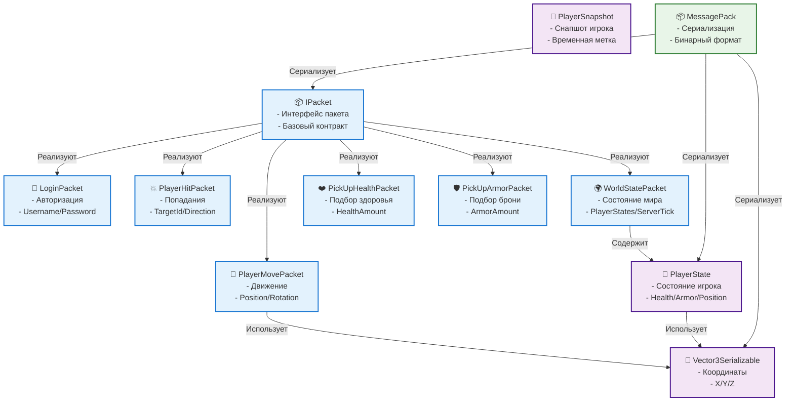

# Общие компоненты (Shared Components)

## Обзор

Общие компоненты используются как клиентом, так и сервером для обеспечения совместимости и корректной работы системы.

## Архитектура общих компонентов



## Сетевые пакеты

### IPacket
**Назначение**: Базовый интерфейс для всех сетевых пакетов
**Описание**: Определяет контракт для сериализации пакетов

```csharp
public interface IPacket
{
    // Интерфейс-маркер для всех пакетов
}
```

### LoginPacket
**Назначение**: Авторизация игрока на сервере
**Структура**:
```csharp
[MessagePackObject]
public class LoginPacket : IPacket
{
    [Key(0)]
    public string Username { get; set; }
    
    [Key(1)]
    public string Password { get; set; } // опционально
}
```

**Использование**:
- Клиент отправляет при подключении
- Сервер валидирует и регистрирует игрока
- Возвращает PlayerId в ответе

### PlayerMovePacket
**Назначение**: Передача позиции и поворота игрока
**Структура**:
```csharp
[MessagePackObject]
public class PlayerMovePacket : IPacket
{
    [Key(0)]
    public Vector3Serializable Position { get; set; }
    
    [Key(1)]
    public Vector3Serializable Rotation { get; set; }
    
    [Key(2)]
    public long ClientTick { get; set; }
}
```

**Использование**:
- Клиент отправляет при движении
- Сервер валидирует и обновляет состояние
- Рассылается другим игрокам

### PlayerHitPacket
**Назначение**: Сообщение о попадании по другому игроку
**Структура**:
```csharp
[MessagePackObject]
public class PlayerHitPacket : IPacket
{
    [Key(0)]
    public int TargetId { get; set; }
    
    [Key(1)]
    public long ClientTick { get; set; }
    
    [Key(2)]
    public Vector3Serializable Direction { get; set; }
}
```

**Использование**:
- Клиент отправляет при стрельбе
- Сервер валидирует попадание
- Обновляет здоровье цели

### WorldStatePacket
**Назначение**: Передача состояния мира от сервера клиентам
**Структура**:
```csharp
[MessagePackObject]
public class WorldStatePacket : IPacket
{
    [Key(0)]
    public List<PlayerState> PlayerStates { get; set; }
    
    [Key(1)]
    public long ServerTick { get; set; }
}
```

**Использование**:
- Сервер регулярно рассылает
- Клиенты обновляют состояние
- Синхронизация всех игроков

### PickUpHealthPacket
**Назначение**: Сообщение о подборе аптечки
**Структура**:
```csharp
[MessagePackObject]
public class PickUpHealthPacket : IPacket
{
    [Key(0)]
    public long ClientTick { get; set; }
    
    [Key(1)]
    public int HealthAmount { get; set; }
}
```

### PickUpArmorPacket
**Назначение**: Сообщение о подборе брони
**Структура**:
```csharp
[MessagePackObject]
public class PickUpArmorPacket : IPacket
{
    [Key(0)]
    public long ClientTick { get; set; }
    
    [Key(1)]
    public int ArmorAmount { get; set; }
}
```

## Data Transfer Objects (DTOs)

### PlayerState
**Назначение**: DTO для передачи состояния игрока
**Структура**:
```csharp
[MessagePackObject]
public class PlayerState
{
    [Key(0)]
    public int Id { get; set; }
    
    [Key(1)]
    public required string Username { get; set; }
    
    [Key(2)]
    public Vector3Serializable Position { get; set; }
    
    [Key(3)]
    public Vector3Serializable Rotation { get; set; }
    
    [Key(4)]
    public int HealthPoint { get; set; }
    
    [Key(5)]
    public int MaxHealthPoint { get; set; } = 100;
    
    [Key(6)]
    public int ArmorPoint { get; set; }
    
    [Key(7)]
    public int MaxArmorPoint { get; set; } = 100;
    
    [Key(8)]
    public long ArmorExpirationTick { get; set; }
}
```

**Методы**:
```csharp
public bool TakeDamage(int damage, long tick)
{
    if (this.ArmorExpirationTick > tick) 
    { 
        this.ArmorPoint = 0; 
    }
    
    if (this.ArmorPoint >= damage) {
        this.ArmorPoint -= damage;
        return false;
    } else if (this.ArmorPoint > 0) {
        damage -= this.ArmorPoint;
        this.ArmorPoint = 0;
    }
    
    this.HealthPoint -= damage;
    if (this.HealthPoint <= 0) { 
        this.HealthPoint = 0;
        return true; 
    }
    return false;
}

public void ObtainArmor(long tick) {
    this.ArmorPoint = this.MaxArmorPoint;
    this.ArmorExpirationTick = tick;
}
```

### Vector3Serializable
**Назначение**: DTO для передачи координат
**Структура**:
```csharp
[MessagePackObject]
public class Vector3Serializable
{
    [Key(0)]
    public float X { get; set; }
    
    [Key(1)]
    public float Y { get; set; }
    
    [Key(2)]
    public float Z { get; set; }
    
    public Vector3Serializable() { }
    
    public Vector3Serializable(float x, float y, float z)
    {
        X = x;
        Y = y;
        Z = z;
    }
    
    public Vector3Serializable(Vector3 vector)
    {
        X = vector.X;
        Y = vector.Y;
        Z = vector.Z;
    }
}
```

**Конвертация**:
```csharp
// Unity Vector3 -> Vector3Serializable
var serializable = new Vector3Serializable(transform.position.x, transform.position.y, transform.position.z);

// Vector3Serializable -> Unity Vector3
var unityVector = new UnityEngine.Vector3(serializable.X, serializable.Y, serializable.Z);

// Domain Vector3 -> Vector3Serializable
var serializable = new Vector3Serializable(domainVector.X, domainVector.Y, domainVector.Z);
```

### PlayerSnapshot
**Назначение**: Снапшот состояния игрока для интерполяции
**Структура**:
```csharp
[MessagePackObject]
public class PlayerSnapshot
{
    [Key(0)]
    public int PlayerId { get; set; }
    
    [Key(1)]
    public Vector3Serializable Position { get; set; }
    
    [Key(2)]
    public Vector3Serializable Rotation { get; set; }
    
    [Key(3)]
    public long Timestamp { get; set; }
}
```

## Сериализация

### MessagePack
**Назначение**: Бинарная сериализация для эффективной передачи данных
**Преимущества**:
- Компактность (меньше байт)
- Скорость сериализации/десериализации
- Поддержка Unity
- Типобезопасность

**Настройка**:
```csharp
// Unity клиент
var resolver = MessagePack.Resolvers.CompositeResolver.Create(
    MessagePack.Resolvers.StandardResolver.Instance
);
var options = MessagePackSerializerOptions.Standard.WithResolver(resolver);
MessagePackSerializer.DefaultOptions = options;

// .NET сервер
// Используется стандартная настройка MessagePack
```

**Использование**:
```csharp
// Сериализация
var data = MessagePackSerializer.Serialize<IPacket>(packet);

// Десериализация
var packet = MessagePackSerializer.Deserialize<IPacket>(data);
```

## Совместимость

### Версионирование
- **Совместимость**: Обратная совместимость пакетов
- **Расширение**: Добавление новых полей с Key(n)
- **Валидация**: Проверка обязательных полей

### Типы данных
- **Примитивы**: int, long, float, string
- **Структуры**: Vector3Serializable
- **Коллекции**: List<T>
- **Nullable**: Поддержка null значений

### Обработка ошибок
```csharp
try
{
    var packet = MessagePackSerializer.Deserialize<IPacket>(data);
    // Обработка пакета
}
catch (MessagePackSerializationException ex)
{
    _logger.LogError($"Failed to deserialize packet: {ex.Message}");
    // Обработка ошибки сериализации
}
catch (Exception ex)
{
    _logger.LogError($"Unexpected error: {ex.Message}");
    // Общая обработка ошибок
}
```

## Производительность

### Оптимизации
- **Бинарный формат**: MessagePack вместо JSON
- **Пулинг объектов**: Переиспользование пакетов
- **Буферизация**: Минимизация аллокаций
- **Сжатие**: Встроенное сжатие MessagePack

### Метрики
- **Размер пакета**: ~50-200 байт
- **Скорость сериализации**: < 1ms
- **Пропускная способность**: < 100KB/s на клиент
- **Задержка**: < 16ms обработка

## Безопасность

### Валидация
- **Типы данных**: Проверка корректности типов
- **Диапазоны**: Валидация значений координат
- **Размеры**: Ограничение размера пакетов
- **Частота**: Rate limiting пакетов

### Защита
- **Серверная валидация**: Проверка всех данных
- **Античит**: Валидация движений и действий
- **Логирование**: Запись подозрительной активности
- **Изоляция**: Каждый клиент в своем контексте

## Тестирование

### Unit тесты
```csharp
[Test]
public void TestPlayerStateSerialization()
{
    var playerState = new PlayerState
    {
        Id = 1,
        Username = "TestPlayer",
        Position = new Vector3Serializable(1, 2, 3),
        HealthPoint = 100
    };
    
    var data = MessagePackSerializer.Serialize(playerState);
    var deserialized = MessagePackSerializer.Deserialize<PlayerState>(data);
    
    Assert.AreEqual(playerState.Id, deserialized.Id);
    Assert.AreEqual(playerState.Username, deserialized.Username);
}
```

### Интеграционные тесты
- **Клиент-сервер**: Полный цикл передачи данных
- **Совместимость**: Проверка версий
- **Производительность**: Нагрузочное тестирование

## Планы развития

### Краткосрочные улучшения
- [ ] Добавление новых типов пакетов
- [ ] Оптимизация сериализации
- [ ] Улучшение валидации
- [ ] Расширение DTO

### Среднесрочные улучшения
- [ ] Версионирование протокола
- [ ] Сжатие данных
- [ ] Шифрование пакетов
- [ ] Аналитика трафика

### Долгосрочные улучшения
- [ ] Микросервисная архитектура
- [ ] Кроссплатформенность
- [ ] Облачная синхронизация
- [ ] AI интеграция 