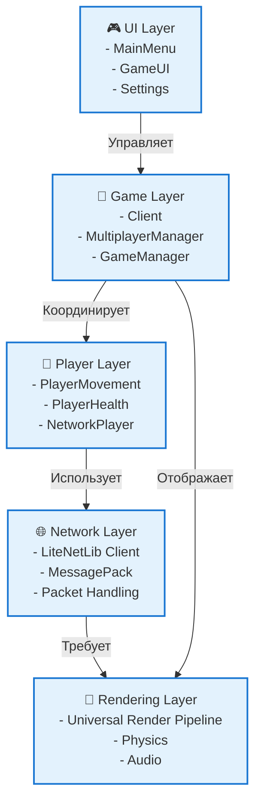

# Unity Client Container

## Обзор

Unity Client — это клиентская часть системы DeathRoom, реализованная на Unity 2022.3 LTS. Клиент отвечает за отображение игрового мира, обработку пользовательского ввода и сетевое взаимодействие с сервером.

## Архитектура



## Структура проекта

```
client/
├── Assets/
│   ├── Scripts/
│   │   ├── Client.cs                 # Основной сетевой клиент
│   │   ├── NetworkPlayer.cs          # Сетевая синхронизация игроков
│   │   ├── Player/
│   │   │   ├── PlayerMovement.cs     # Управление персонажем
│   │   │   ├── PlayerHealth.cs       # Система здоровья
│   │   │   └── PlayerShooting.cs     # Система стрельбы
│   │   ├── UI/
│   │   │   ├── MainMenu.cs           # Главное меню
│   │   │   ├── GameUI.cs             # Игровой интерфейс
│   │   │   └── MultiplayerManager.cs # Управление мультиплеером
│   │   └── Utils/
│   │       ├── Interpolation.cs      # Интерполяция движения
│   │       └── NetworkUtils.cs       # Сетевые утилиты
│   ├── Scenes/
│   │   ├── MainMenu.unity            # Главное меню
│   │   ├── PVP Arena 1.unity         # Игровая сцена
│   │   └── Settings.unity            # Настройки
│   ├── Prefabs/
│   │   ├── Player.prefab             # Префаб игрока
│   │   ├── NetworkPlayer.prefab      # Префаб сетевого игрока
│   │   └── UI/
│   │       ├── MainMenuUI.prefab     # UI главного меню
│   │       └── GameUI.prefab         # UI игры
│   └── Materials/                     # Материалы и текстуры
└── Packages/
    └── manifest.json                  # Unity пакеты
```

## Основные компоненты

### Client.cs
**Назначение**: Основной сетевой клиент
**Ответственность**:
- Подключение к серверу
- Отправка и получение пакетов
- Управление сетевым состоянием
- Координация с игровыми компонентами

**Ключевые методы**:
```csharp
public void ConnectToServer()
public void SendPacket(IPacket packet)
private void OnNetworkReceive(NetPeer peer, NetPacketReader reader)
private void OnConnected(NetPeer peer)
```

### NetworkPlayer.cs
**Назначение**: Сетевая синхронизация других игроков
**Ответственность**:
- Интерполяция движения
- Отображение состояния игроков
- Обработка сетевых обновлений

**Ключевые особенности**:
- Интерполяция позиции и поворота
- Отключение локальных компонентов
- Синхронизация анимаций

### PlayerMovement.cs
**Назначение**: Управление локальным персонажем
**Ответственность**:
- Обработка пользовательского ввода
- Движение персонажа
- Отправка позиции на сервер

**Управление**:
- WASD - движение
- Мышь - поворот камеры
- Пробел - прыжок
- ЛКМ - стрельба

### PlayerHealth.cs
**Назначение**: Система здоровья и брони
**Ответственность**:
- Отслеживание здоровья
- Обработка урона
- UI отображение
- Подбор предметов

## Сетевое взаимодействие

### Подключение к серверу
```csharp
// Инициализация LiteNetLib
netListener = new EventBasedNetListener();
netManager = new NetManager(netListener);

// Подключение
serverPeer = netManager.Connect(serverAddress, serverPort, "DeathRoomSecret");
```

### Отправка пакетов
```csharp
// Движение игрока
var movePacket = new PlayerMovePacket
{
    Position = new Vector3Serializable(transform.position),
    Rotation = new Vector3Serializable(transform.rotation.eulerAngles),
    ClientTick = GetCurrentTick()
};
SendPacket(movePacket);
```

### Получение пакетов
```csharp
private void OnNetworkReceive(NetPeer peer, NetPacketReader reader)
{
    var data = reader.GetRemainingBytes();
    var packet = MessagePackSerializer.Deserialize<IPacket>(data);
    
    switch (packet)
    {
        case WorldStatePacket worldState:
            HandleWorldState(worldState);
            break;
        // ... другие пакеты
    }
}
```

## Пользовательский интерфейс

### MainMenu.cs
**Функциональность**:
- Кнопки навигации
- Настройки подключения
- Выход из игры

### GameUI.cs
**Функциональность**:
- Отображение здоровья
- Счетчик игроков
- Статус подключения
- Настройки игры

### MultiplayerManager.cs
**Функциональность**:
- Управление состоянием подключения
- Переключение между UI панелями
- Обработка ошибок сети

## Оптимизация производительности

### Сетевая оптимизация
- **Частота отправки**: 20 пакетов в секунду
- **Интерполяция**: Плавное движение других игроков
- **Предсказание**: Локальное предсказание движения
- **Сжатие**: MessagePack для компактности

### Графическая оптимизация
- **LOD**: Level of Detail для объектов
- **Occlusion Culling**: Отсечение невидимых объектов
- **Object Pooling**: Переиспользование объектов
- **GPU Instancing**: Массовый рендеринг

### Оптимизация памяти
- **Garbage Collection**: Минимизация аллокаций
- **Object Pooling**: Переиспользование сетевых пакетов
- **Asset Management**: Правильная загрузка ресурсов

## Конфигурация

### Настройки сети
```csharp
[Header("Network Settings")]
public int serverPort = 8050;
public string serverAddress = "77.233.222.200";
public float sendRate = 20f;
```

### Настройки интерполяции
```csharp
[Header("Interpolation Settings")]
public float interpolationSpeed = 10f;
public float maxDistance = 1f;
```

### Настройки производительности
- **Target FPS**: 60
- **VSync**: Отключен для минимальной задержки
- **Quality Settings**: Настраиваемые уровни качества
- **Resolution**: Адаптивное разрешение

## Обработка ошибок

### Сетевые ошибки
```csharp
private void OnNetworkError(IPEndPoint endPoint, SocketError socketError)
{
    Debug.LogError($"Network error: {socketError}");
    // Попытка переподключения
    StartCoroutine(ReconnectAfterDelay());
}
```

### Ошибки подключения
- **Таймаут**: Автоматическое переподключение
- **Неверный адрес**: Уведомление пользователя
- **Сервер недоступен**: Ожидание и повторная попытка

### Ошибки игры
- **Потеря соединения**: Сохранение состояния
- **Некорректные данные**: Валидация пакетов
- **Производительность**: Адаптация качества

## Тестирование

### Unit тесты
- Тестирование сетевой логики
- Валидация пакетов
- Тестирование интерполяции

### Интеграционные тесты
- Подключение к серверу
- Синхронизация состояния
- Обработка ошибок

### Производительность
- Профилирование FPS
- Анализ сетевого трафика
- Тестирование под нагрузкой

## Развертывание

### Сборка
1. **Настройка Build Settings**
2. **Выбор платформы** (Windows, macOS, Linux)
3. **Настройка качества**
4. **Сборка исполняемого файла**

### Распространение
- **Steam**: Платформа распространения
- **Собственный сайт**: Прямое скачивание
- **Unity Cloud Build**: Автоматическая сборка

## Мониторинг

### Метрики клиента
- **FPS**: Частота кадров
- **Ping**: Задержка сети
- **Packet Loss**: Потеря пакетов
- **Memory Usage**: Использование памяти

### Логирование
```csharp
Debug.Log($"Connected to server: {serverAddress}:{serverPort}");
Debug.LogWarning($"High ping detected: {ping}ms");
Debug.LogError($"Connection lost: {error}");
```

## Планы развития

### Краткосрочные улучшения
- [ ] Улучшение UI/UX
- [ ] Оптимизация сетевого кода
- [ ] Добавление звуковых эффектов
- [ ] Система настроек

### Среднесрочные улучшения
- [ ] Мобильная версия
- [ ] Система достижений
- [ ] Кастомизация персонажа
- [ ] Чат между игроками

### Долгосрочные улучшения
- [ ] VR поддержка
- [ ] Кроссплатформенная игра
- [ ] Моддинг система
- [ ] Облачное сохранение 