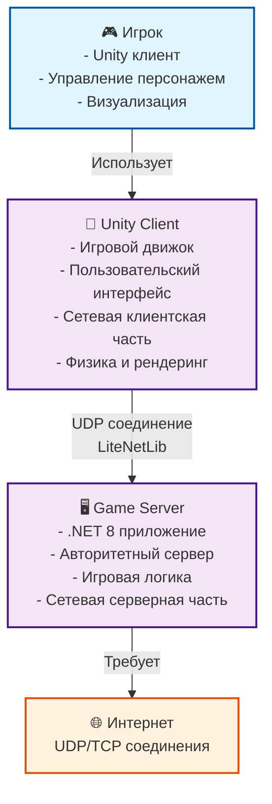

# Обзор контейнеров DeathRoom

## Описание

Диаграмма контейнеров показывает высокоуровневую техническую архитектуру системы DeathRoom. Контейнеры представляют собой развертываемые единицы системы, которые взаимодействуют друг с другом.

## Диаграмма



## Описание контейнеров

### Unity Client
**Технология**: Unity 2022.3 LTS, C#
**Ответственность**:
- Отображение игрового мира
- Обработка пользовательского ввода
- Сетевая клиентская часть
- Физика и анимация
- Пользовательский интерфейс

**Основные компоненты**:
- **Client.cs**: Сетевая клиентская часть
- **NetworkPlayer.cs**: Сетевая синхронизация игроков
- **PlayerMovement.cs**: Управление персонажем
- **PlayerHealth.cs**: Система здоровья
- **UI Components**: Пользовательский интерфейс

**Технические характеристики**:
- **Платформы**: Windows, macOS, Linux
- **Сеть**: LiteNetLib клиент
- **Сериализация**: MessagePack
- **Графика**: Universal Render Pipeline

### Game Server
**Технология**: .NET 8, C#
**Ответственность**:
- Авторитетный сервер игры
- Обработка игровой логики
- Управление состоянием мира
- Сетевая серверная часть
- Валидация действий игроков

**Основные компоненты**:
- **DeathRoom-Backend**: Точка входа
- **DeathRoom.Application**: Бизнес-логика
- **DeathRoom.Domain**: Доменная модель
- **DeathRoom.Common**: Общие компоненты

**Технические характеристики**:
- **Платформы**: Linux (рекомендуется), Windows, macOS
- **Сеть**: LiteNetLib сервер
- **Архитектура**: Clean Architecture + DDD
- **Хранение**: In-memory

## Технологический стек

### Unity Client
```
Unity 2022.3 LTS
├── C# (.NET Standard 2.1)
├── LiteNetLib Client
├── MessagePack
├── Universal Render Pipeline
├── Unity UI
└── Unity Physics
```

### Game Server
```
.NET 8
├── C# (язык программирования)
├── LiteNetLib Server
├── MessagePack
├── Microsoft.Extensions.Hosting
├── Clean Architecture
└── Domain-Driven Design
```

## Сетевое взаимодействие

### Протокол
- **Транспорт**: UDP через LiteNetLib
- **Сериализация**: MessagePack
- **Порт**: 9050 (сервер), динамический (клиент)
- **Надежность**: Встроенная в LiteNetLib

### Типы пакетов
1. **LoginPacket**: Авторизация
2. **PlayerMovePacket**: Движение
3. **PlayerHitPacket**: Попадания
4. **WorldStatePacket**: Состояние мира
5. **PickUpHealthPacket**: Подбор здоровья
6. **PickUpArmorPacket**: Подбор брони

### Сетевая модель
- **Клиент-сервер**: Авторитетный сервер
- **Частота обновлений**: 60 Hz
- **Интерполяция**: Клиентская
- **Предсказание**: Клиентское движение

## Архитектурные решения

### 1. Монолитный сервер
**Проблема**: Простота разработки и развертывания
**Решение**: Один сервер для всей игровой логики
**Преимущества**:
- Простота разработки
- Низкая задержка
- Простое развертывание
- Отсутствие проблем с консистентностью

### 2. Unity как клиент
**Проблема**: Требуется мощный игровой движок
**Решение**: Unity для клиентской части
**Преимущества**:
- Готовые инструменты разработки
- Кроссплатформенность
- Богатая экосистема
- Профессиональные возможности

### 3. .NET для сервера
**Проблема**: Высокая производительность и производительность разработки
**Решение**: .NET 8 для серверной части
**Преимущества**:
- Высокая производительность
- Богатая экосистема
- Отличная поддержка асинхронности
- Сильная типизация

## Масштабируемость

### Текущие ограничения
- **Один сервер**: Все игроки на одном сервере
- **In-memory**: Данные теряются при перезапуске
- **География**: Один регион развертывания

### Планы масштабирования
1. **Горизонтальное масштабирование**: Множественные серверы
2. **База данных**: Персистентное хранение
3. **Микросервисы**: Разделение ответственности
4. **Облачная инфраструктура**: Автоматическое масштабирование

## Безопасность

### Сетевая безопасность
- **Валидация**: Серверная проверка всех действий
- **Античит**: Серверная валидация движения
- **Защита от DDoS**: Ограничения подключений
- **Шифрование**: Возможность добавления TLS

### Игровая безопасность
- **Серверная авторитетность**: Все важные решения на сервере
- **Валидация пакетов**: Проверка корректности данных
- **Ограничения**: Лимиты на действия игроков
- **Логирование**: Запись подозрительной активности

## Мониторинг и логирование

### Сервер
- **Логирование**: Console.WriteLine для ключевых событий
- **Метрики**: Количество игроков, производительность
- **Алерты**: Автоматическое уведомление о проблемах

### Клиент
- **Логирование**: Unity Debug.Log
- **Профилирование**: Встроенные инструменты Unity
- **Статистика**: FPS, задержка сети

## Развертывание

### Сервер
```bash
# Сборка
dotnet build -c Release

# Запуск
dotnet run --project DeathRoom-Backend

# Docker
docker build -t deathroom-server .
docker run -p 9050:9050 deathroom-server
```

### Клиент
- **Разработка**: Unity Editor
- **Сборка**: Unity Build Settings
- **Распространение**: Unity Cloud Build или ручная сборка

## Производительность

### Целевые метрики
- **Сервер**: 100+ одновременных игроков
- **Клиент**: 60 FPS на средних настройках
- **Сеть**: < 100ms задержка
- **Память**: < 2GB на сервер, < 4GB на клиент

### Оптимизации
- **Сетевая**: Оптимизированная сериализация
- **Графика**: LOD, occlusion culling
- **Память**: Object pooling, garbage collection
- **CPU**: Многопоточность, асинхронность

## Следующие шаги

1. **Детализация компонентов**: Переход к уровню компонентов
2. **API документация**: Спецификация интерфейсов
3. **Тестирование**: Unit и интеграционные тесты
4. **CI/CD**: Автоматизация сборки и развертывания 