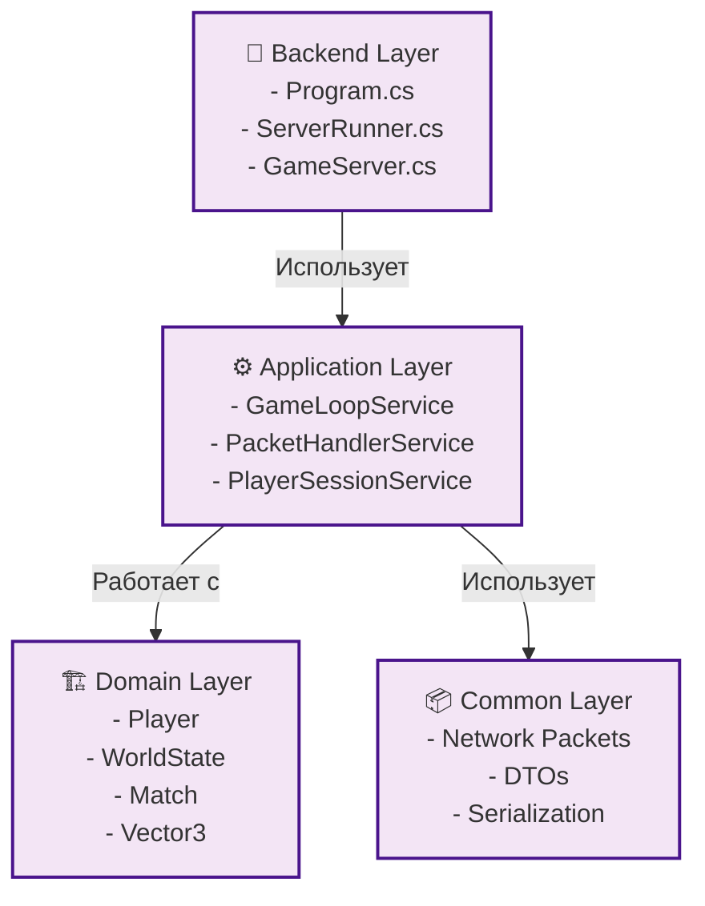

# Game Server Container

## Обзор

Game Server — это серверная часть системы DeathRoom, реализованная на .NET 8 с использованием Clean Architecture и Domain-Driven Design.

## Архитектура



## Основные компоненты

### Backend Layer
- **Program.cs**: Точка входа, DI конфигурация
- **ServerRunner.cs**: HostedService, жизненный цикл
- **GameServer.cs**: Сетевой сервер, LiteNetLib

### Application Layer
- **GameLoopService.cs**: Основной игровой цикл
- **PacketHandlerService.cs**: Обработка сетевых пакетов
- **PlayerSessionService.cs**: Управление сессиями
- **WorldStateService.cs**: Хранение состояния мира
- **HitRegistrationService.cs**: Регистрация урона
- **HitPhysicsService.cs**: Физика попаданий

### Domain Layer
- **Player.cs**: Сущность игрока
- **PlayerState.cs**: Состояние игрока
- **WorldState.cs**: Состояние мира
- **Vector3.cs**: Value object координат

### Common Layer
- **Network Packets**: LoginPacket, PlayerMovePacket, WorldStatePacket
- **DTOs**: PlayerState, Vector3Serializable
- **Serialization**: MessagePack

## Сетевое взаимодействие

### Протокол
- **Транспорт**: UDP через LiteNetLib
- **Сериализация**: MessagePack
- **Порт**: 9050
- **Частота**: 60 Hz

### Типы пакетов
1. **LoginPacket**: Авторизация игрока
2. **PlayerMovePacket**: Движение персонажа
3. **PlayerHitPacket**: Регистрация попаданий
4. **WorldStatePacket**: Состояние мира
5. **PickUpHealthPacket/PickUpArmorPacket**: Подбор предметов

## Конфигурация

### Переменные окружения
```bash
DEATHROOM_BROADCAST_INTERVAL_MS=15
DEATHROOM_IDLE_INTERVAL_MS=100
DEATHROOM_WORLDSTATE_HISTORY_LENGTH=20
DEATHROOM_WORLDSTATE_SAVE_INTERVAL=10
```

## Развертывание

### Локальная разработка
```bash
cd server
dotnet run --project DeathRoom-Backend/DeathRoom-Backend.csproj
```

### Docker
```bash
docker build -t deathroom-server .
docker run -p 9050:9050 deathroom-server
```

## Производительность

### Метрики
- **Одновременные игроки**: 100+
- **Частота обновлений**: 60 Hz
- **Задержка обработки**: < 16ms
- **Использование памяти**: < 2GB

### Оптимизации
- **In-memory хранение**: Быстрый доступ к данным
- **Асинхронная обработка**: Неблокирующие операции
- **Оптимизированная сериализация**: MessagePack
- **Эффективная сеть**: LiteNetLib

## Безопасность

### Валидация
- **Серверная авторитетность**: Все важные решения на сервере
- **Валидация пакетов**: Проверка корректности данных
- **Античит**: Серверная валидация движения
- **Ограничения**: Лимиты на действия игроков

## Мониторинг

### Логирование
```csharp
logging.AddSimpleConsole(options =>
{
    options.SingleLine = true;
    options.TimestampFormat = "HH:mm:ss ";
});
```

### Метрики
- **Количество игроков**: Активные подключения
- **Производительность**: Время обработки пакетов
- **Сеть**: Статистика LiteNetLib
- **Память**: Использование heap 