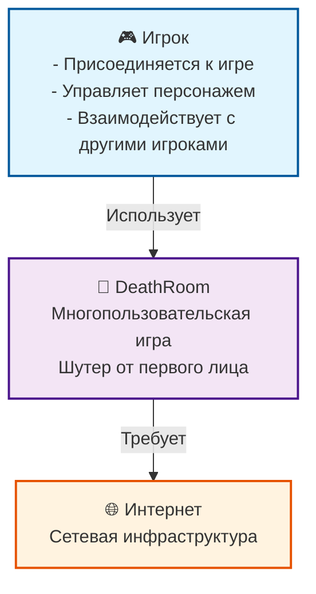

# Контекстная диаграмма системы DeathRoom

## Описание

Контекстная диаграмма показывает систему DeathRoom в контексте пользователей и внешних систем. Это самый высокий уровень абстракции в C4 модели.

## Диаграмма

## Описание компонентов

### Пользователи

#### Игрок (Player)
- **Роль**: Основной пользователь системы
- **Цели**:
  - Присоединиться к многопользовательской игре
  - Управлять персонажем в реальном времени
  - Взаимодействовать с другими игроками
  - Получать удовольствие от игрового процесса
- **Действия**:
  - Авторизация в игре
  - Движение персонажа
  - Стрельба и взаимодействие
  - Общение с другими игроками

### Система

#### DeathRoom
- **Тип**: Многопользовательская игра
- **Жанр**: Шутер от первого лица
- **Архитектура**: Клиент-сервер
- **Основные возможности**:
  - Реальное время взаимодействие
  - Физика и коллизии
  - Система здоровья и брони
  - Многопользовательские матчи
  - Сетевая синхронизация

### Внешние системы

#### Интернет
- **Роль**: Сетевая инфраструктура
- **Требования**:
  - Стабильное интернет-соединение
  - Низкая задержка (ping < 100ms)
  - Достаточная пропускная способность
- **Ограничения**:
  - Качество соединения влияет на игровой опыт
  - Возможны разрывы соединения

## Технические требования

### Клиентская часть
- **Платформа**: Unity 2022.3 LTS
- **Минимальные требования**:
  - ОС: Windows 10/11, macOS 10.15+, Linux
  - Процессор: Intel i3 / AMD Ryzen 3
  - Память: 4GB RAM
  - Графика: DirectX 11 совместимая
  - Сеть: Стабильное интернет-соединение

### Серверная часть
- **Платформа**: .NET 8
- **Требования**:
  - ОС: Linux (рекомендуется), Windows, macOS
  - Процессор: 2+ ядра
  - Память: 2GB RAM
  - Сеть: Стабильное соединение, открытый порт 9050

## Ограничения и допущения

### Ограничения
- **Сетевая зависимость**: Игра требует стабильного интернет-соединения
- **Производительность**: Качество игры зависит от производительности клиента
- **Масштабируемость**: Ограничена производительностью сервера
- **Платформы**: Поддержка ограничена Unity-совместимыми платформами

### Допущения
- **Сетевая инфраструктура**: Доступна и стабильна
- **Пользователи**: Имеют базовые навыки работы с компьютером
- **Безопасность**: Сетевая безопасность обеспечивается внешними средствами
- **Мониторинг**: Система мониторинга развернута отдельно

## Метрики успеха

### Пользовательские метрики
- **Время подключения**: < 5 секунд
- **Задержка**: < 100ms ping
- **Стабильность**: 99% uptime
- **Удовлетворенность**: > 4.0/5.0

### Технические метрики
- **Производительность**: 60 FPS на минимальных настройках
- **Сетевая эффективность**: < 100KB/s на клиент
- **Масштабируемость**: 100+ одновременных игроков
- **Надежность**: < 1% потери пакетов

## Риски и митигация

### Высокие риски
1. **Сетевые проблемы**
   - **Риск**: Высокая задержка или разрывы соединения
   - **Митигация**: Адаптивная сетевая логика, переподключение

2. **Производительность клиента**
   - **Риск**: Низкая производительность на слабых машинах
   - **Митигация**: Настраиваемые графические опции

### Средние риски
1. **Масштабируемость сервера**
   - **Риск**: Превышение лимитов производительности
   - **Митигация**: Мониторинг и оптимизация

2. **Безопасность**
   - **Риск**: Читерство и эксплойты
   - **Митигация**: Серверная валидация, античит

## Следующие шаги

1. **Детализация контейнеров**: Переход к уровню контейнеров
2. **Техническая архитектура**: Детальное описание компонентов
3. **API документация**: Спецификация интерфейсов
4. **Развертывание**: Инфраструктура и deployment 