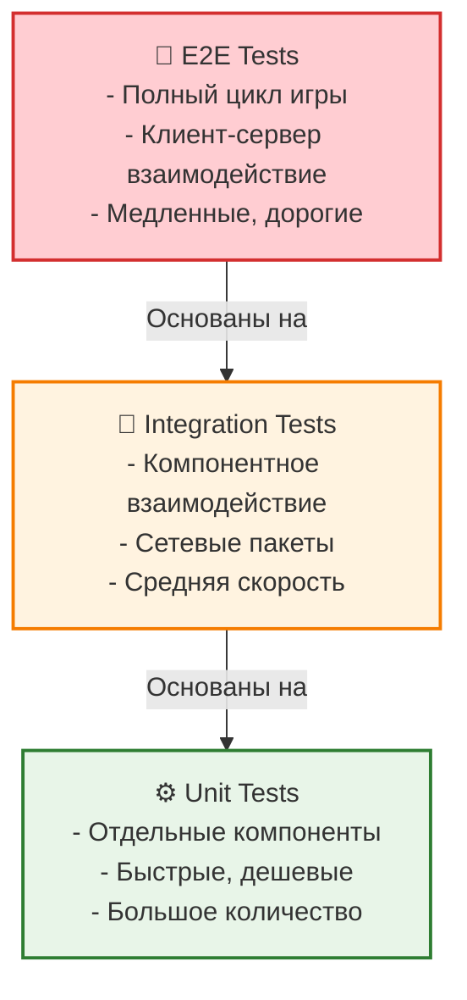

# Тестирование DeathRoom

## Обзор

Данный документ описывает стратегию тестирования для проекта DeathRoom, включая различные типы тестов, инструменты и лучшие практики.

## Стратегия тестирования

### Пирамида тестирования



### Принципы тестирования

1. **Автоматизация**: Все тесты должны выполняться автоматически
2. **Быстрота**: Unit тесты должны выполняться быстро (< 1 секунды)
3. **Изоляция**: Тесты не должны зависеть друг от друга
4. **Детерминированность**: Результаты должны быть предсказуемыми
5. **Покрытие**: Стремиться к высокому покрытию кода

## Unit тесты

### Серверные тесты

#### Тестирование доменной логики
```csharp
[TestFixture]
public class PlayerTests
{
    [Test]
    public void TakeDamage_WithArmor_ShouldReduceArmorFirst()
    {
        // Arrange
        var player = new Player { Id = 1, Username = "TestPlayer" };
        player.PlayerState.HealthPoint = 100;
        player.PlayerState.ArmorPoint = 50;
        
        // Act
        var isKill = player.TakeDamage(30, 1000);
        
        // Assert
        Assert.IsFalse(isKill);
        Assert.AreEqual(70, player.PlayerState.HealthPoint);
        Assert.AreEqual(20, player.PlayerState.ArmorPoint);
    }
    
    [Test]
    public void TakeDamage_WithoutArmor_ShouldReduceHealth()
    {
        // Arrange
        var player = new Player { Id = 1, Username = "TestPlayer" };
        player.PlayerState.HealthPoint = 100;
        player.PlayerState.ArmorPoint = 0;
        
        // Act
        var isKill = player.TakeDamage(30, 1000);
        
        // Assert
        Assert.IsFalse(isKill);
        Assert.AreEqual(70, player.PlayerState.HealthPoint);
        Assert.AreEqual(0, player.PlayerState.ArmorPoint);
    }
    
    [Test]
    public void TakeDamage_LethalDamage_ShouldKillPlayer()
    {
        // Arrange
        var player = new Player { Id = 1, Username = "TestPlayer" };
        player.PlayerState.HealthPoint = 50;
        player.PlayerState.ArmorPoint = 0;
        
        // Act
        var isKill = player.TakeDamage(100, 1000);
        
        // Assert
        Assert.IsTrue(isKill);
        Assert.AreEqual(0, player.PlayerState.HealthPoint);
    }
}
```

#### Тестирование сервисов
```csharp
[TestFixture]
public class HitPhysicsServiceTests
{
    private HitPhysicsService _service;
    
    [SetUp]
    public void Setup()
    {
        _service = new HitPhysicsService();
    }
    
    [Test]
    public void ValidateHit_ValidHit_ShouldReturnTrue()
    {
        // Arrange
        var attacker = new Player { Id = 1 };
        attacker.PlayerState.Position = new Vector3(0, 0, 0);
        
        var target = new Player { Id = 2 };
        target.PlayerState.Position = new Vector3(10, 0, 0);
        
        var direction = new Vector3(1, 0, 0);
        
        // Act
        var result = _service.ValidateHit(attacker, target, direction);
        
        // Assert
        Assert.IsTrue(result);
    }
    
    [Test]
    public void ValidateHit_TooFarDistance_ShouldReturnFalse()
    {
        // Arrange
        var attacker = new Player { Id = 1 };
        attacker.PlayerState.Position = new Vector3(0, 0, 0);
        
        var target = new Player { Id = 2 };
        target.PlayerState.Position = new Vector3(100, 0, 0);
        
        var direction = new Vector3(1, 0, 0);
        
        // Act
        var result = _service.ValidateHit(attacker, target, direction);
        
        // Assert
        Assert.IsFalse(result);
    }
}
```

#### Тестирование сериализации
```csharp
[TestFixture]
public class PacketSerializationTests
{
    [Test]
    public void PlayerMovePacket_Serialization_ShouldWork()
    {
        // Arrange
        var packet = new PlayerMovePacket
        {
            Position = new Vector3Serializable(1, 2, 3),
            Rotation = new Vector3Serializable(45, 90, 180),
            ClientTick = 12345
        };
        
        // Act
        var data = MessagePackSerializer.Serialize(packet);
        var deserialized = MessagePackSerializer.Deserialize<PlayerMovePacket>(data);
        
        // Assert
        Assert.AreEqual(packet.Position.X, deserialized.Position.X);
        Assert.AreEqual(packet.Position.Y, deserialized.Position.Y);
        Assert.AreEqual(packet.Position.Z, deserialized.Position.Z);
        Assert.AreEqual(packet.Rotation.X, deserialized.Rotation.X);
        Assert.AreEqual(packet.ClientTick, deserialized.ClientTick);
    }
}
```

### Клиентские тесты

#### Тестирование Unity компонентов
```csharp
[TestFixture]
public class PlayerMovementTests
{
    private GameObject _playerObject;
    private PlayerMovement _playerMovement;
    
    [SetUp]
    public void Setup()
    {
        _playerObject = new GameObject("TestPlayer");
        _playerMovement = _playerObject.AddComponent<PlayerMovement>();
    }
    
    [TearDown]
    public void Teardown()
    {
        Object.DestroyImmediate(_playerObject);
    }
    
    [Test]
    public void Move_ValidDirection_ShouldUpdatePosition()
    {
        // Arrange
        var initialPosition = _playerObject.transform.position;
        var direction = new Vector3(1, 0, 0);
        
        // Act
        _playerMovement.Move(direction);
        
        // Assert
        Assert.AreNotEqual(initialPosition, _playerObject.transform.position);
    }
}
```

#### Тестирование сетевой логики
```csharp
[TestFixture]
public class NetworkPlayerTests
{
    [Test]
    public void UpdateState_NewPosition_ShouldInterpolate()
    {
        // Arrange
        var networkPlayer = new NetworkPlayer();
        var oldState = new PlayerState
        {
            Position = new Vector3Serializable(0, 0, 0)
        };
        var newState = new PlayerState
        {
            Position = new Vector3Serializable(10, 0, 0)
        };
        
        networkPlayer.Initialize(oldState);
        
        // Act
        networkPlayer.UpdateState(newState);
        
        // Assert
        // Проверяем, что интерполяция работает
        Assert.IsTrue(networkPlayer.IsInterpolating);
    }
}
```

## Интеграционные тесты

### Тестирование клиент-сервер взаимодействия
```csharp
[TestFixture]
public class ClientServerIntegrationTests
{
    private GameServer _server;
    private Client _client;
    
    [SetUp]
    public void Setup()
    {
        _server = new GameServer();
        _server.Start();
        
        _client = new Client();
    }
    
    [TearDown]
    public void Teardown()
    {
        _client?.Disconnect();
        _server?.Stop();
    }
    
    [Test]
    public async Task PlayerConnection_ShouldCreateSession()
    {
        // Arrange
        var loginPacket = new LoginPacket { Username = "TestPlayer" };
        
        // Act
        var connected = await _client.ConnectAsync("localhost", 9050);
        var loginResult = await _client.SendPacketAsync(loginPacket);
        
        // Assert
        Assert.IsTrue(connected);
        Assert.IsTrue(loginResult);
        Assert.IsTrue(_server.HasPlayer("TestPlayer"));
    }
    
    [Test]
    public async Task PlayerMovement_ShouldSyncToOtherPlayers()
    {
        // Arrange
        var client1 = new Client();
        var client2 = new Client();
        
        await client1.ConnectAsync("localhost", 9050);
        await client2.ConnectAsync("localhost", 9050);
        
        var movePacket = new PlayerMovePacket
        {
            Position = new Vector3Serializable(10, 0, 0),
            Rotation = new Vector3Serializable(0, 90, 0)
        };
        
        // Act
        await client1.SendPacketAsync(movePacket);
        await Task.Delay(100); // Ждем синхронизации
        
        // Assert
        // Проверяем, что второй клиент получил обновление
        var worldState = client2.GetLastWorldState();
        Assert.IsNotNull(worldState);
        Assert.IsTrue(worldState.PlayerStates.Any(p => p.Position.X > 5));
    }
}
```

### Тестирование сетевых пакетов
```csharp
[TestFixture]
public class PacketIntegrationTests
{
    [Test]
    public void PacketFlow_LoginToGameplay_ShouldWork()
    {
        // Arrange
        var packetHandler = new PacketHandlerService();
        var mockPeer = CreateMockPeer();
        
        // Act & Assert
        // 1. Логин
        var loginPacket = new LoginPacket { Username = "TestPlayer" };
        var loginResult = packetHandler.HandlePacket(mockPeer, SerializePacket(loginPacket));
        Assert.IsTrue(loginResult);
        
        // 2. Движение
        var movePacket = new PlayerMovePacket
        {
            Position = new Vector3Serializable(1, 0, 0),
            Rotation = new Vector3Serializable(0, 0, 0)
        };
        var moveResult = packetHandler.HandlePacket(mockPeer, SerializePacket(movePacket));
        Assert.IsTrue(moveResult);
        
        // 3. Стрельба
        var hitPacket = new PlayerHitPacket
        {
            TargetId = 2,
            Direction = new Vector3Serializable(1, 0, 0)
        };
        var hitResult = packetHandler.HandlePacket(mockPeer, SerializePacket(hitPacket));
        Assert.IsTrue(hitResult);
    }
}
```

## E2E тесты

### Полный игровой цикл
```csharp
[TestFixture]
public class EndToEndGameTests
{
    private GameServer _server;
    private List<Client> _clients;
    
    [SetUp]
    public void Setup()
    {
        _server = new GameServer();
        _server.Start();
        _clients = new List<Client>();
    }
    
    [TearDown]
    public void Teardown()
    {
        foreach (var client in _clients)
        {
            client.Disconnect();
        }
        _server.Stop();
    }
    
    [Test]
    public async Task FullGameSession_ShouldCompleteSuccessfully()
    {
        // Arrange
        var player1 = new Client();
        var player2 = new Client();
        _clients.Add(player1);
        _clients.Add(player2);
        
        // Act
        // 1. Подключение игроков
        await player1.ConnectAsync("localhost", 9050);
        await player2.ConnectAsync("localhost", 9050);
        
        await player1.LoginAsync("Player1");
        await player2.LoginAsync("Player2");
        
        // 2. Игровой процесс
        for (int i = 0; i < 10; i++)
        {
            await player1.MoveAsync(new Vector3(i, 0, 0));
            await player2.MoveAsync(new Vector3(0, 0, i));
            await Task.Delay(16); // 60 FPS
        }
        
        // 3. Стрельба
        await player1.ShootAsync(player2.GetPlayerId());
        
        // Assert
        Assert.IsTrue(player1.IsConnected);
        Assert.IsTrue(player2.IsConnected);
        Assert.IsTrue(player2.GetHealth() < 100); // Получил урон
    }
}
```

## Нагрузочное тестирование

### Тестирование производительности
```csharp
[TestFixture]
public class PerformanceTests
{
    [Test]
    public async Task ServerPerformance_100Players_ShouldHandleLoad()
    {
        // Arrange
        var server = new GameServer();
        server.Start();
        
        var clients = new List<Client>();
        var tasks = new List<Task>();
        
        // Act
        // Создаем 100 клиентов
        for (int i = 0; i < 100; i++)
        {
            var client = new Client();
            clients.Add(client);
            
            var task = Task.Run(async () =>
            {
                await client.ConnectAsync("localhost", 9050);
                await client.LoginAsync($"Player{i}");
                
                // Симулируем активность
                for (int j = 0; j < 100; j++)
                {
                    await client.MoveAsync(new Vector3(j, 0, 0));
                    await Task.Delay(16);
                }
            });
            
            tasks.Add(task);
        }
        
        // Ждем завершения всех задач
        await Task.WhenAll(tasks);
        
        // Assert
        Assert.IsTrue(server.GetPlayerCount() == 100);
        Assert.IsTrue(server.GetAveragePing() < 100); // Ping < 100ms
        Assert.IsTrue(server.GetMemoryUsage() < 2 * 1024 * 1024 * 1024); // < 2GB
    }
}
```

## Инструменты тестирования

### .NET тестирование
```xml
<!-- DeathRoom.Tests.csproj -->
<Project Sdk="Microsoft.NET.Sdk">
  <PropertyGroup>
    <TargetFramework>net8.0</TargetFramework>
    <IsPackable>false</IsPackable>
  </PropertyGroup>
  
  <ItemGroup>
    <PackageReference Include="Microsoft.NET.Test.Sdk" Version="17.8.0" />
    <PackageReference Include="NUnit" Version="4.0.1" />
    <PackageReference Include="NUnit3TestAdapter" Version="4.5.0" />
    <PackageReference Include="Moq" Version="4.20.70" />
    <PackageReference Include="FluentAssertions" Version="6.12.0" />
  </ItemGroup>
  
  <ItemGroup>
    <ProjectReference Include="../DeathRoom.Domain/DeathRoom.Domain.csproj" />
    <ProjectReference Include="../DeathRoom.Application/DeathRoom.Application.csproj" />
    <ProjectReference Include="../DeathRoom.Common/DeathRoom.Common.csproj" />
  </ItemGroup>
</Project>
```

### Unity тестирование
```csharp
// TestRunner настройки
[TestFixture]
public class UnityTests
{
    [UnityTest]
    public IEnumerator PlayerMovement_ShouldUpdateTransform()
    {
        // Arrange
        var player = new GameObject("TestPlayer");
        var movement = player.AddComponent<PlayerMovement>();
        
        // Act
        movement.Move(new Vector3(1, 0, 0));
        
        // Ждем один кадр
        yield return null;
        
        // Assert
        Assert.AreNotEqual(Vector3.zero, player.transform.position);
    }
}
```

## Автоматизация тестирования

### CI/CD Pipeline
```yaml
# .github/workflows/test.yml
name: Tests

on: [push, pull_request]

jobs:
  test:
    runs-on: ubuntu-latest
    
    steps:
    - uses: actions/checkout@v3
    
    - name: Setup .NET
      uses: actions/setup-dotnet@v3
      with:
        dotnet-version: 8.0.x
    
    - name: Restore dependencies
      run: dotnet restore
    
    - name: Build
      run: dotnet build --no-restore
    
    - name: Test
      run: dotnet test --no-build --verbosity normal
    
    - name: Upload coverage
      uses: codecov/codecov-action@v3
      with:
        file: ./coverage.xml
```

### Локальное выполнение
```bash
# Запуск всех тестов
dotnet test

# Запуск с покрытием
dotnet test --collect:"XPlat Code Coverage"

# Запуск конкретного теста
dotnet test --filter "TestCategory=Unit"

# Запуск с подробным выводом
dotnet test --logger "console;verbosity=detailed"
```

## Метрики качества

### Покрытие кода
- **Цель**: > 80% покрытие
- **Критический код**: > 90% покрытие
- **Инструмент**: dotCover, Codecov

### Время выполнения
- **Unit тесты**: < 1 секунды каждый
- **Интеграционные тесты**: < 10 секунд каждый
- **E2E тесты**: < 60 секунд каждый

### Надежность
- **Стабильность**: > 95% успешных прогонов
- **Флаки**: < 1% нестабильных тестов
- **Повторяемость**: Детерминированные результаты

## Лучшие практики

### Написание тестов
1. **AAA паттерн**: Arrange, Act, Assert
2. **Один тест - одна проверка**
3. **Понятные имена тестов**
4. **Изоляция тестов**

### Организация тестов
```csharp
[TestFixture]
public class PlayerServiceTests
{
    // Группировка по функциональности
    [TestFixture]
    public class DamageTests
    {
        [Test]
        public void TakeDamage_WithArmor_ShouldReduceArmorFirst() { }
        
        [Test]
        public void TakeDamage_WithoutArmor_ShouldReduceHealth() { }
    }
    
    [TestFixture]
    public class MovementTests
    {
        [Test]
        public void Move_ValidPosition_ShouldUpdateState() { }
        
        [Test]
        public void Move_InvalidPosition_ShouldReject() { }
    }
}
```

### Mock объекты
```csharp
[Test]
public void HandlePacket_WithMockPeer_ShouldProcessCorrectly()
{
    // Arrange
    var mockPeer = new Mock<NetPeer>();
    var mockLogger = new Mock<ILogger<PacketHandlerService>>();
    var service = new PacketHandlerService(mockLogger.Object);
    
    var packet = new LoginPacket { Username = "TestPlayer" };
    var data = MessagePackSerializer.Serialize(packet);
    
    // Act
    service.HandlePacket(mockPeer.Object, data);
    
    // Assert
    mockLogger.Verify(x => x.LogInformation(It.IsAny<string>()), Times.Once);
}
```

## Отладка тестов

### Логирование в тестах
```csharp
[Test]
public void ComplexTest_WithLogging_ShouldWork()
{
    // Arrange
    var logger = new ConsoleLogger();
    logger.LogInformation("Starting complex test");
    
    // Act
    var result = PerformComplexOperation();
    
    // Assert
    logger.LogInformation($"Test completed with result: {result}");
    Assert.IsTrue(result);
}
```

### Визуализация результатов
```csharp
[Test]
public void PerformanceTest_WithMetrics_ShouldMeetRequirements()
{
    // Arrange
    var stopwatch = Stopwatch.StartNew();
    
    // Act
    var result = PerformOperation();
    stopwatch.Stop();
    
    // Assert
    TestContext.WriteLine($"Operation took: {stopwatch.ElapsedMilliseconds}ms");
    Assert.IsTrue(stopwatch.ElapsedMilliseconds < 100);
    Assert.IsTrue(result);
}
```

## Заключение

Комплексная стратегия тестирования обеспечивает:
- **Качество кода**: Раннее выявление ошибок
- **Рефакторинг**: Безопасные изменения
- **Документацию**: Тесты как живая документация
- **Уверенность**: Стабильная работа системы
- **Производительность**: Оптимизация критических путей 