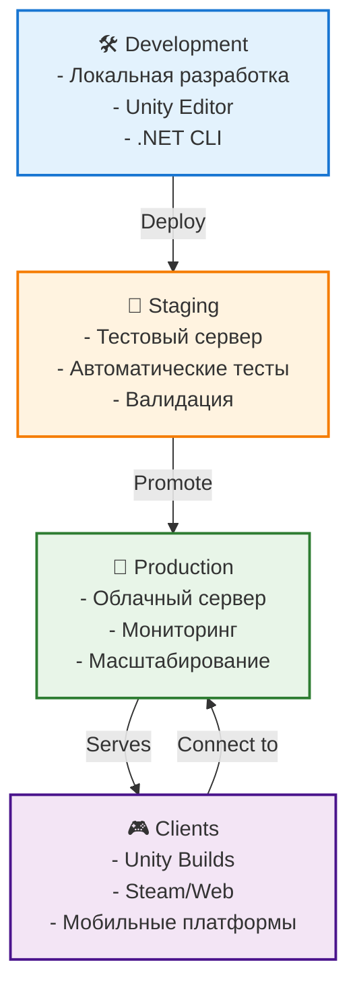

# Развертывание DeathRoom

## Обзор

Данный документ описывает процессы развертывания серверной и клиентской частей проекта DeathRoom в различных средах.

## Архитектура развертывания



## Серверное развертывание

### Локальная разработка

#### Требования
```bash
# Системные требования
- .NET 8 SDK
- Git
- IDE (Visual Studio/Rider/VS Code)
- Docker (опционально)

# Проверка установки
dotnet --version  # Должно быть 8.0.x
git --version
docker --version  # Если используется
```

#### Настройка окружения
```bash
# Клонирование проекта
git clone <repository-url>
cd DeathRoom/server

# Восстановление зависимостей
dotnet restore

# Сборка проекта
dotnet build

# Запуск в режиме разработки
dotnet run --project DeathRoom-Backend/DeathRoom-Backend.csproj
```

#### Переменные окружения
```bash
# .env файл для разработки
DEATHROOM_BROADCAST_INTERVAL_MS=15
DEATHROOM_IDLE_INTERVAL_MS=100
DEATHROOM_WORLDSTATE_HISTORY_LENGTH=20
DEATHROOM_WORLDSTATE_SAVE_INTERVAL=10
DEATHROOM_SERVER_PORT=9050
DEATHROOM_MAX_PLAYERS=100
DEATHROOM_MAX_HIT_DISTANCE=50.0
DEATHROOM_MAX_HIT_ANGLE=30.0
```

### Docker развертывание

#### Dockerfile
```dockerfile
# Dockerfile
FROM mcr.microsoft.com/dotnet/aspnet:8.0 AS base
WORKDIR /app
EXPOSE 9050

FROM mcr.microsoft.com/dotnet/sdk:8.0 AS build
WORKDIR /src
COPY ["DeathRoom-Backend/DeathRoom-Backend.csproj", "DeathRoom-Backend/"]
COPY ["DeathRoom.Application/DeathRoom.Application.csproj", "DeathRoom.Application/"]
COPY ["DeathRoom.Domain/DeathRoom.Domain.csproj", "DeathRoom.Domain/"]
COPY ["DeathRoom.Common/DeathRoom.Common.csproj", "DeathRoom.Common/"]
RUN dotnet restore "DeathRoom-Backend/DeathRoom-Backend.csproj"
COPY . .
WORKDIR "/src/DeathRoom-Backend"
RUN dotnet build "DeathRoom-Backend.csproj" -c Release -o /app/build

FROM build AS publish
RUN dotnet publish "DeathRoom-Backend.csproj" -c Release -o /app/publish

FROM base AS final
WORKDIR /app
COPY --from=publish /app/publish .
ENTRYPOINT ["dotnet", "DeathRoom-Backend.dll"]
```

#### Docker Compose
```yaml
# docker-compose.yml
version: '3.8'

services:
  deathroom-server:
    build: .
    ports:
      - "9050:9050"
    environment:
      - DEATHROOM_BROADCAST_INTERVAL_MS=15
      - DEATHROOM_IDLE_INTERVAL_MS=100
      - DEATHROOM_WORLDSTATE_HISTORY_LENGTH=20
      - DEATHROOM_WORLDSTATE_SAVE_INTERVAL=10
      - DEATHROOM_SERVER_PORT=9050
      - DEATHROOM_MAX_PLAYERS=100
    restart: unless-stopped
    networks:
      - deathroom-network

networks:
  deathroom-network:
    driver: bridge
```

#### Команды развертывания
```bash
# Сборка образа
docker build -t deathroom-server .

# Запуск контейнера
docker run -p 9050:9050 deathroom-server

# Использование Docker Compose
docker-compose up -d

# Просмотр логов
docker logs deathroom-server

# Остановка
docker-compose down
```

### Облачное развертывание

#### AWS EC2
```bash
# Подключение к серверу
ssh -i key.pem ubuntu@your-server-ip

# Установка .NET 8
wget https://packages.microsoft.com/config/ubuntu/22.04/packages-microsoft-prod.deb -O packages-microsoft-prod.deb
sudo dpkg -i packages-microsoft-prod.deb
sudo apt update
sudo apt install dotnet-sdk-8.0

# Клонирование проекта
git clone <repository-url>
cd DeathRoom/server

# Сборка и запуск
dotnet publish -c Release -o /opt/deathroom
sudo systemctl enable deathroom-server
sudo systemctl start deathroom-server
```

#### Systemd сервис
```ini
# /etc/systemd/system/deathroom-server.service
[Unit]
Description=DeathRoom Game Server
After=network.target

[Service]
Type=simple
User=deathroom
WorkingDirectory=/opt/deathroom
ExecStart=/usr/bin/dotnet DeathRoom-Backend.dll
Restart=always
RestartSec=10
Environment=DEATHROOM_SERVER_PORT=9050
Environment=DEATHROOM_MAX_PLAYERS=100

[Install]
WantedBy=multi-user.target
```

#### Nginx конфигурация
```nginx
# /etc/nginx/sites-available/deathroom
server {
    listen 80;
    server_name your-domain.com;

    location / {
        proxy_pass http://localhost:9050;
        proxy_http_version 1.1;
        proxy_set_header Upgrade $http_upgrade;
        proxy_set_header Connection 'upgrade';
        proxy_set_header Host $host;
        proxy_set_header X-Real-IP $remote_addr;
        proxy_set_header X-Forwarded-For $proxy_add_x_forwarded_for;
        proxy_set_header X-Forwarded-Proto $scheme;
        proxy_cache_bypass $http_upgrade;
    }
}
```

### Kubernetes развертывание

#### Deployment
```yaml
# k8s/deployment.yaml
apiVersion: apps/v1
kind: Deployment
metadata:
  name: deathroom-server
  labels:
    app: deathroom-server
spec:
  replicas: 3
  selector:
    matchLabels:
      app: deathroom-server
  template:
    metadata:
      labels:
        app: deathroom-server
    spec:
      containers:
      - name: deathroom-server
        image: deathroom-server:latest
        ports:
        - containerPort: 9050
        env:
        - name: DEATHROOM_SERVER_PORT
          value: "9050"
        - name: DEATHROOM_MAX_PLAYERS
          value: "100"
        resources:
          requests:
            memory: "512Mi"
            cpu: "250m"
          limits:
            memory: "1Gi"
            cpu: "500m"
        livenessProbe:
          tcpSocket:
            port: 9050
          initialDelaySeconds: 30
          periodSeconds: 10
        readinessProbe:
          tcpSocket:
            port: 9050
          initialDelaySeconds: 5
          periodSeconds: 5
```

#### Service
```yaml
# k8s/service.yaml
apiVersion: v1
kind: Service
metadata:
  name: deathroom-service
spec:
  selector:
    app: deathroom-server
  ports:
  - protocol: TCP
    port: 80
    targetPort: 9050
  type: LoadBalancer
```

#### Ingress
```yaml
# k8s/ingress.yaml
apiVersion: networking.k8s.io/v1
kind: Ingress
metadata:
  name: deathroom-ingress
  annotations:
    nginx.ingress.kubernetes.io/rewrite-target: /
spec:
  rules:
  - host: deathroom.your-domain.com
    http:
      paths:
      - path: /
        pathType: Prefix
        backend:
          service:
            name: deathroom-service
            port:
              number: 80
```

## Клиентское развертывание

### Unity Build

#### Настройка сборки
1. **Build Settings** (File → Build Settings)
2. **Выбор платформы**:
   - Windows (x86_64)
   - macOS (Universal)
   - Linux (x86_64)
   - WebGL (опционально)

#### Настройки качества
```csharp
// Quality Settings
- Pixel Light Count: 4
- Texture Quality: Full Res
- Anisotropic Textures: Per Texture
- Anti Aliasing: 4x Multi Sampling
- Soft Particles: Enabled
- Realtime Reflection Probes: Enabled
- Billboards Facing Camera Position: Enabled
- Shadow Resolution: High
- Shadow Projection: Close Fit
- Shadow Distance: 150
- Shadow Cascades: 4
- Shadow Near Plane Offset: 3
- Shadow Normal Bias: 1
- Shadow Depth Bias: 2
- Shadow Culling: All
```

#### Player Settings
```csharp
// Player Settings
- Company Name: DeathRoom
- Product Name: DeathRoom
- Version: 1.0.0
- Default Icon: Set custom icon
- Cursor Hotspot: Center
- Default Cursor: Custom cursor
- Cursor Hotspot: Center
- Default Cursor: Custom cursor
```

### Steam развертывание

#### Steam App ID
```json
// steam_appid.txt
1234567890
```

#### Steam Build
```bash
# Создание Steam build
steamcmd +login your_steam_account +app_build 1234567890 +app_build_script app_build_script.vdf +quit
```

#### Steam App Build Script
```vdf
// app_build_script.vdf
"appbuild"
{
    "appid" "1234567890"
    "desc" "DeathRoom Build"
    "buildoutput" "build"
    "contentroot" "content"
    "setlive" "beta"
    "preview" "0"
    "local" ""
    "depots"
    {
        "1234567891"
        {
            "filemapping"
            {
                "localpath" "."
                "remotepath" "."
            }
        }
    }
}
```

### Web развертывание

#### WebGL настройки
```csharp
// WebGL Settings
- Compression Format: Disabled
- Data Caching: Enabled
- Exception Support: Full
- Memory Size: 512MB
- Development Build: Disabled
- Compression Format: Disabled
```

#### HTML Template
```html
<!-- index.html -->
<!DOCTYPE html>
<html>
<head>
    <meta charset="utf-8">
    <title>DeathRoom</title>
    <style>
        body { margin: 0; padding: 0; }
        #unityContainer { width: 100%; height: 100vh; }
    </style>
</head>
<body>
    <div id="unityContainer"></div>
    <script src="Build/UnityLoader.js"></script>
    <script>
        var unityInstance = UnityLoader.instantiate(
            document.querySelector("#unityContainer"),
            "Build/DeathRoom.json"
        );
    </script>
</body>
</html>
```

## CI/CD Pipeline

### GitHub Actions

#### Серверная сборка
```yaml
# .github/workflows/server-build.yml
name: Server Build

on:
  push:
    branches: [ main, develop ]
    paths: [ 'server/**' ]
  pull_request:
    branches: [ main ]
    paths: [ 'server/**' ]

jobs:
  build:
    runs-on: ubuntu-latest
    
    steps:
    - uses: actions/checkout@v3
    
    - name: Setup .NET
      uses: actions/setup-dotnet@v3
      with:
        dotnet-version: 8.0.x
    
    - name: Restore dependencies
      run: dotnet restore server/
    
    - name: Build
      run: dotnet build server/ --no-restore --configuration Release
    
    - name: Test
      run: dotnet test server/ --no-build --verbosity normal
    
    - name: Publish
      run: dotnet publish server/DeathRoom-Backend/DeathRoom-Backend.csproj -c Release -o publish/
    
    - name: Upload artifacts
      uses: actions/upload-artifact@v3
      with:
        name: server-build
        path: publish/
```

#### Клиентская сборка
```yaml
# .github/workflows/client-build.yml
name: Client Build

on:
  push:
    branches: [ main, develop ]
    paths: [ 'client/**' ]
  pull_request:
    branches: [ main ]
    paths: [ 'client/**' ]

jobs:
  build:
    runs-on: ubuntu-latest
    
    steps:
    - uses: actions/checkout@v3
    
    - name: Cache Library
      uses: actions/cache@v3
      with:
        path: client/Library
        key: Library-${{ hashFiles('client/Packages/manifest.json') }}
    
    - name: Build Windows
      run: |
        unity-builder build \
          --targetPlatform Windows \
          --buildPath build/Windows \
          --buildName DeathRoom.exe
      
    - name: Build macOS
      run: |
        unity-builder build \
          --targetPlatform macOS \
          --buildPath build/macOS \
          --buildName DeathRoom.app
      
    - name: Upload artifacts
      uses: actions/upload-artifact@v3
      with:
        name: client-builds
        path: build/
```

#### Автоматическое развертывание
```yaml
# .github/workflows/deploy.yml
name: Deploy

on:
  push:
    branches: [ main ]

jobs:
  deploy-staging:
    runs-on: ubuntu-latest
    environment: staging
    
    steps:
    - uses: actions/checkout@v3
    
    - name: Deploy to staging
      run: |
        # Развертывание на staging сервер
        ssh user@staging-server "cd /opt/deathroom && git pull"
        ssh user@staging-server "sudo systemctl restart deathroom-server"
    
  deploy-production:
    runs-on: ubuntu-latest
    environment: production
    needs: deploy-staging
    
    steps:
    - uses: actions/checkout@v3
    
    - name: Deploy to production
      run: |
        # Развертывание на production сервер
        ssh user@production-server "cd /opt/deathroom && git pull"
        ssh user@production-server "sudo systemctl restart deathroom-server"
```

## Мониторинг и логирование

### Логирование
```csharp
// Настройка логирования
services.AddLogging(logging =>
{
    logging.ClearProviders();
    logging.AddConsole();
    logging.AddFile("logs/deathroom-{Date}.txt");
    logging.AddSeq("http://seq-server:5341");
});
```

### Метрики
```csharp
// Prometheus метрики
public class MetricsService
{
    private readonly Counter _playersConnected;
    private readonly Gauge _activePlayers;
    private readonly Histogram _packetProcessingTime;
    
    public MetricsService()
    {
        _playersConnected = Metrics.CreateCounter("players_connected_total", "Total players connected");
        _activePlayers = Metrics.CreateGauge("active_players", "Currently active players");
        _packetProcessingTime = Metrics.CreateHistogram("packet_processing_seconds", "Packet processing time");
    }
}
```

### Health Checks
```csharp
// Health checks
services.AddHealthChecks()
    .AddCheck("server", () => HealthCheckResult.Healthy())
    .AddCheck("database", () => HealthCheckResult.Healthy())
    .AddCheck("network", () => HealthCheckResult.Healthy());
```

## Безопасность

### Firewall настройки
```bash
# UFW настройки
sudo ufw allow 22/tcp    # SSH
sudo ufw allow 80/tcp     # HTTP
sudo ufw allow 443/tcp    # HTTPS
sudo ufw allow 9050/udp   # Game server
sudo ufw enable
```

### SSL/TLS
```nginx
# Nginx SSL конфигурация
server {
    listen 443 ssl;
    server_name your-domain.com;
    
    ssl_certificate /path/to/certificate.crt;
    ssl_certificate_key /path/to/private.key;
    
    location / {
        proxy_pass http://localhost:9050;
        # ... остальные настройки
    }
}
```

### Обновления безопасности
```bash
# Автоматические обновления
sudo apt update && sudo apt upgrade -y
sudo unattended-upgrades --dry-run
sudo unattended-upgrades
```

## Резервное копирование

### Автоматические бэкапы
```bash
#!/bin/bash
# backup.sh

DATE=$(date +%Y%m%d_%H%M%S)
BACKUP_DIR="/backup/deathroom"
SOURCE_DIR="/opt/deathroom"

# Создание бэкапа
tar -czf $BACKUP_DIR/deathroom_$DATE.tar.gz $SOURCE_DIR

# Удаление старых бэкапов (старше 30 дней)
find $BACKUP_DIR -name "deathroom_*.tar.gz" -mtime +30 -delete
```

### Cron job
```bash
# /etc/cron.daily/deathroom-backup
0 2 * * * /opt/deathroom/scripts/backup.sh
```

## Устранение неполадок

### Диагностика
```bash
# Проверка статуса сервиса
sudo systemctl status deathroom-server

# Просмотр логов
sudo journalctl -u deathroom-server -f

# Проверка портов
netstat -tulpn | grep 9050

# Проверка ресурсов
htop
df -h
free -h
```

### Восстановление
```bash
# Восстановление из бэкапа
tar -xzf /backup/deathroom/deathroom_20231201_120000.tar.gz -C /opt/

# Перезапуск сервиса
sudo systemctl restart deathroom-server

# Проверка работоспособности
curl http://localhost:9050/health
```

## Заключение

Правильное развертывание обеспечивает:
- **Надежность**: Стабильная работа системы
- **Масштабируемость**: Возможность роста нагрузки
- **Безопасность**: Защита от угроз
- **Мониторинг**: Контроль состояния системы
- **Восстановление**: Быстрое восстановление после сбоев 